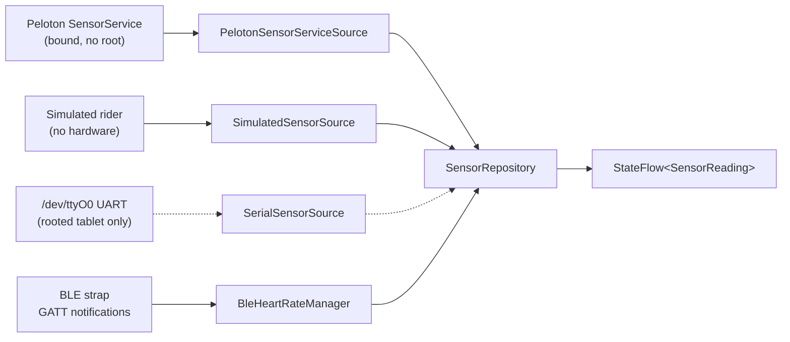
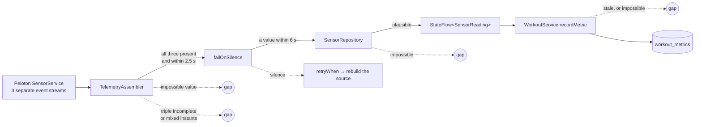
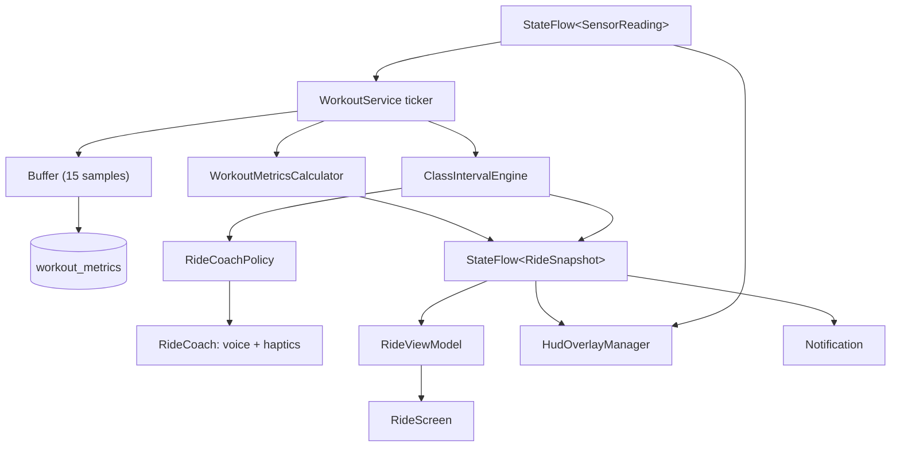
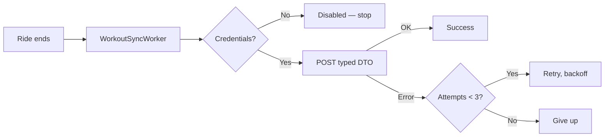

# Pelonot — Technical Overview

How data gets into the app, what happens to it, and where it goes.

**Target:** API 24 (Android 7.0) – API 34 · **Kotlin** · **Jetpack Compose**

---

## The one-paragraph version

Cadence, resistance and watts arrive from **Peloton's own sensor service**,
which the app binds like any other Android service — the bike's tablet is stock
and nothing here needs root. They are merged with heart rate from a Bluetooth
strap and published as a single `StateFlow<SensorReading>`. A foreground service samples that flow once a
second, writes each sample to SQLite, keeps running totals, advances the class
through its intervals, decides whether to say anything about it, and drives a
floating HUD docked to the edge of whatever the rider is watching. When the ride
ends the totals are finalised on the workout row, analysed for an FTP
breakthrough, and optionally uploaded. Everything works with no network; the
cloud is a mirror, never a dependency.

---

## 1. Data coming in

There are three independent inputs. Nothing else enters the app.



### 1a. The bike — Peloton's own sensor service

**This is the path that runs, and every earlier assumption about it was wrong.**
The app spent most of its history preparing to read the sensor board's UART
directly, on a bike it assumed was jailbroken. It is not: the tablet is stock,
`/dev/ttyO0` belongs to `system:system`, `/dev/ttyS1` does not exist and
`/dev/ttyS2` is Bluetooth. No app can open any of them.

What works is binding Peloton's `SensorService`, which is exported with no
`android:permission`, so the bind simply succeeds. `PelotonSensorServiceSource`
does that and receives cadence, resistance **and power** — so on real hardware
the watts are *measured by the board*, not modelled, and `PowerModel` does not
run at all during a bike ride. `SensorReading.powerIsMeasured` marks which is
which. See PLAN.md 2.1a.

### 1a-bis. The bike — serial, for a rooted tablet only

`SerialSensorSource` and `SerialProtocolParser` are correct code aimed at a
target this project does not have. They are kept for a rooted tablet and are
exercised by nothing on stock hardware. What follows describes them.

The Gen 1/Gen 2 sensor board exposes a UART as a character device. It is read as
a plain file; baud rate and line discipline are whatever the kernel already has
configured at boot.

The wire protocol is single-byte commands:

```
'C'          one flywheel revolution
'R' <value>  resistance knob position (0–100)
```

Reads are **not framed**. A 64-byte read can end on an `R` whose value byte
arrives in the next read, so `SerialProtocolParser` is a stateful stream parser
that carries the partial command across the boundary. It also has to treat the
byte after `R` as a value even when it happens to equal `'C'` (67).

`SensorSource` exposes this as a **cold flow**: collecting opens the port,
cancelling closes it, and transport errors are *thrown* rather than swallowed so
the collector can decide what to do.

### 1b. Cadence and power — derived, not measured

The board reports ticks, not RPM, and does not report power at all.

- **`CadenceTracker`** converts tick timestamps to RPM, averaging a short window
  to damp jitter. Critically it is also polled on a timer, so cadence **decays
  to zero** when ticks stop — otherwise a rider who stops pedalling keeps
  reading 90 RPM forever and every downstream metric keeps accruing.
- **`PowerModel`** estimates watts as a cubic in cadence scaled by resistance.

> ⚠️ **The power coefficients are measurably wrong** — median absolute error
> 66% against samples off the real board — **and on a bike they do not run at
> all.** The sensor board reports watts directly (§1a), so `PowerModel` governs
> only simulated rides and the prescribed resistance band. A modelled watt must
> never be presented as measured. PLAN.md 2.2a settles what is being done about
> it; do not add a third consumer of this model.

### 1c. Heart rate — Bluetooth LE

Standard Heart Rate Service (`0x180D`), Heart Rate Measurement characteristic
(`0x2A37`). Scanning filters on the service UUID rather than device names.

Connecting is a four-step handshake, and the fourth step is the one that is
easy to miss:

1. Scan and connect GATT
2. Discover services
3. `setCharacteristicNotification(...)` — routes notifications *locally*
4. **Write `ENABLE_NOTIFICATION_VALUE` to the CCCD descriptor** — this is what
   actually tells the strap to start sending. Without it, nothing ever arrives.

Packets are `[flags][value…]`. Bit 0 of flags selects uint8 or little-endian
uint16. Parsing is bounds-checked and returns null on a truncated packet: it
runs on the Binder callback thread, where an exception kills the process.

`heartRateBpm` is nullable everywhere. **Null means unknown**, and must never be
conflated with a measured zero — a rider with no strap is not a rider with no
pulse.

### 1d. Simulation

`SimulatedSensorSource` generates a plausible effort profile — warmup ramp, two
sinusoids of different periods, per-sample jitter, and heart rate integrated
towards a power-derived target so it lags the way a real one does. Power runs
through the same `PowerModel`, so everything downstream sees numerically
consistent data rather than a parallel set of fake values.

Selected by `SensorMode` in Settings:

| Mode | Behaviour |
|------|-----------|
| `Auto` | Serial if the device exists, otherwise simulated |
| `Hardware` | Serial only — **retries rather than falling back** |
| `Simulated` | Always fake, for development |

`Hardware` never falls back on purpose: silently substituting invented telemetry
mid-ride would write fabricated numbers into the rider's permanent record.

### 1e. Merging and retries

`SensorRepository` merges the bike source with heart rate into one
`StateFlow<SensorReading>`, and owns **all** retry policy — one `retryWhen` with
capped exponential backoff. Sources deliberately do not reconnect themselves;
when they did, `close()` triggered a reconnect and `reconnect()` called
`close()`, so ending a workout started an endless loop.

### 1f. Three refusals between the board and the record

The first real ride recorded cadence 603 rpm off a rider turning the cranks at
61 (PLAN.md 2.7). Three things now stand between a bad value and the rider's
permanent record, and all three answer with an **absence** rather than a
number — the same doctrine as nullable `heartRateBpm` and `isStaleAt`:



- **`TelemetryAssembler`** turns the board's three independent streams into one
  reading, and only when all three are present and mutually fresh. It is pure
  Kotlin so the seam can be tested; the code it replaced kept three `var`s
  starting at `0.0` and published all three whenever any one moved.
- **`failOnSilence`** makes a source that has stopped delivering *fail*, which
  is the only thing `retryWhen` can see. Without it a dead board stayed dead
  for the rest of the ride.
- **`TelemetryBounds`** rejects and never clamps. A clamped 603 is a plausible
  lie standing where a gap belongs, and no later reader can tell it from a real
  sprint. Checked at publication *and* at the recording boundary, because only
  the second one makes a number permanent.

**None of this fixes the rotation** (2.7.1). Values swapping columns *within*
the plausible range pass every bound there is.

---

## 2. Data flowing through a ride



`WorkoutService` is a bound foreground service. On ride start it:

1. Inserts the `workouts` row with `is_complete = 0`
2. Starts the sensor repository
3. Starts a 250 ms ticker

**The workout row must exist first.** `workout_metrics` has a foreign key onto
`workouts`, so writing a sample against a row that does not yet exist raises a
constraint violation — which is exactly what happened when the row was only
inserted at ride end, and why no ride ever captured a time series.

Each whole second the ticker:

- reads the latest `SensorReading`
- folds it into `WorkoutMetricsCalculator`
- appends a `WorkoutMetricEntity` to an in-memory buffer, flushed every 15
  samples (one transaction per second for an hour is a lot of writes on
  tablet-grade flash)
- updates the session's running means
- evaluates `ClassIntervalEngine` and publishes a new `RideSnapshot`
- asks `RideCoachPolicy` whether any of that is worth saying out loud
- finishes the ride if the class timer has run out

**Elapsed time is measured, not counted** — `SystemClock.elapsedRealtime()`
minus accumulated pause time. A `delay(1000)` loop drifts, because `delay` is a
lower bound and the loop body's own cost accumulates.

### What the calculator derives

| Metric | How |
|--------|-----|
| Total output (kJ) | `∫P dt` by the trapezoidal rule against **elapsed time** |
| Distance (km) | Revolutions × 2.1 m, accumulated |
| Rolling averages | 1 s / 5 s / 30 s time windows |
| Power zone | `PowerZone.forPower(watts, ftp)` |

Sample gaps are clamped at 5 s, so a backgrounded app cannot integrate idle time
as though the rider pedalled through it. `WorkoutAggregates` recomputes the same
figures from a stored series when a crashed ride has to be rebuilt, and matches
this clamp deliberately — a recovered ride has to be comparable with one that
finished normally, not a differently shaped number with the same name.

### 2a. The class clock

`ClassIntervalEngine` is a **pure function of elapsed time**, not a timer.

```kotlin
engine.stateAt(elapsedSec): IntervalState
```

That is the whole design. The ride already has one authoritative clock —
`elapsedRealtime()` minus paused time — and a second timer running alongside it
would drift away over a 45-minute class until the two disagreed about which
interval was running. Evaluating the engine on the existing ticker means pausing
the ride pauses the class for free, and there is no state to keep in sync.

`IntervalState` carries the current interval, the next one (**null on the final
interval**, so nothing can promise an effort the class will not deliver), the
index, elapsed and remaining time, and a `RideCue`. The cue lands on the last
*hard* interval rather than the last one: most classes end on a cooldown, and
telling a rider to empty the tank during a Zone 1 spin-down is worse than saying
nothing.

### 2b. The coach

Two halves, split on purpose:

| Piece | Responsibility | Testable? |
|-------|---------------|-----------|
| `RideCoachPolicy` | *Whether* to say something | Pure, JVM-tested |
| `RideCoach` | Speaking and buzzing | Android; does no thinking |

All the restraint lives in the policy: drift from target has to persist 12 s
before it is mentioned and 45 s before it is mentioned again, a rider who has
stopped pedalling is never told to pedal harder, and the five-second countdown
buzzes on every tick but speaks only once. A rider watching a film will tolerate
a handful of cues per class and nothing else.

`CoachStyle` — Spoken, Silent or Off — decides how much of that reaches them.
Silent is the default, because a bike in a shared room should not talk unasked;
in that mode the HUD's motion *is* the announcement. The countdown itself is
never optional in any mode.

Speech uses `USAGE_ASSISTANCE_NAVIGATION_GUIDANCE` audio attributes, so the
system ducks the rider's video under it instead of the cue being drowned by it.

---

## 3. Where data comes to rest

```
profiles ──┬─< workouts ──< workout_metrics
           │      │           (CASCADE delete)
class_templates ──┘
```

| Table | Written when | Contains |
|-------|-------------|----------|
| `profiles` | Profile created/edited | Name, weight, FTP, `auth_user_id` |
| `class_templates` | First launch (seeded from assets) | Title, category, duration, `intervals_json` |
| `workouts` | Ride **start**, updated at end | Aggregates, RPE, `is_complete` |
| `workout_metrics` | Every second | Cadence, resistance, power, HR, `power_is_measured` |

`is_complete` does double duty: it keeps in-progress rides out of history and
leaderboards, and it is the crash-recovery marker — an unfinished row means the
process died mid-ride.

App preferences (theme, sensor mode, selected profile, strap address, sync
toggle) live in **DataStore**, not Room, since they are not relational.

`profiles.auth_user_id` is **the consent gate**: null means this rider has no
account, and therefore no cloud. See *Out to the cloud* below.

`workout_metrics.power_is_measured` says where each second's watts came from —
the board, or `PowerModel`. Null means it was recorded before the app kept
track, which is **not** the same as modelled. `PowerProvenance` is the per-ride
verdict, and only a wholly measured ride may propose an FTP change (7.10.7) or
appear on the household leaderboard (24.4.2).

### Class templates in

`assets/classes/<category>/<id>.json` — the seeder lists the directory, so
adding a folder is enough. **All 72 classes ship in the APK** and the seeder
reads nothing else: the cloud is an update channel for a signed-in rider, never
the source of the first copy (PLAN 23.2).

```json
{
  "id": "TB-01",
  "title": "Tabata Sprint 20",
  "category": "Tabata Bursts",
  "duration_sec": 1200,
  "intervals_json": "[{\"time_start_sec\":0,\"time_end_sec\":240,\"target_cadence_min\":80,\"target_cadence_max\":90,\"target_power_zone\":1}]"
}
```

`intervals_json` is a JSON **string** containing an array. Field names are
snake_case and segments carry start/end timestamps rather than durations —
`Interval` matches this exactly with `@SerialName`. When it did not, every
decode threw and no class ever displayed a single interval.

---

## 4. Data going out

### To the screen

Room and DataStore expose `Flow`s. Repositories combine them, ViewModels
`stateIn` them, and Compose collects with `collectAsStateWithLifecycle` so
collection stops when the app is backgrounded.

```
Room/DataStore Flow → Repository → ViewModel StateFlow → Composable
```

No composable touches a DAO. Nothing lives in `remember {}` that should survive
rotation.

### To the cloud (optional)



Credentials come from `local.properties` → `BuildConfig`, never from source:

```properties
supabase.url=https://your-project.supabase.co
supabase.anonKey=your-anon-key
```

Omit them and `SupabaseModule.client` is null, every call returns
`SyncOutcome.Disabled`, and the app is fully functional offline. `Disabled` is
deliberately distinct from `Failed` so the worker can tell "there is no cloud,
stop asking" from "the network is down, try again".

**Credentials are not consent.** Every call also passes through `CloudAccess`,
which asks whether *this profile* has an account (`auth_user_id != null`) —
per rider, checked at `SupabaseSyncRepository`'s single choke point before the
client is resolved. No method can be called without naming the rider it acts
for. Nothing sets `auth_user_id` until Phase 15, so today every call is
`Disabled` and no build reaches the network at all.

Payloads are typed `@Serializable` DTOs. They were previously
`Map<String, Any?>` — kotlinx.serialization has no serializer for `Any`, so
every call threw and was swallowed by `runCatching`.

### To the analyser

On ride end, `PostWorkoutAnalyzer` reads the full metric series and looks for:

- **20-minute peak power** → `FTP ≈ P₂₀ × 0.95`, via an O(n) sliding window over
  full-length windows only
- **Biometric decoupling** — sustained Zone 4 at under 80% of max HR
- **RPE** — a hard class rated ≤ 4 suggests a 3% bump

A proposal only surfaces if it beats the current FTP by more than 2%; below that
it is inside the noise of the power model.

---

## 5. The HUD

This is the surface the app is really for. A rider starts a class, switches to
Netflix, and looks at Pelonot in glances for the next forty minutes.

So the overlay is **not a floating card**. It is a full-width strip docked to
one screen edge — top by default, because subtitles live along the bottom —
leaving the middle of the screen, where faces are, completely clear. Dragging
its handle snaps it to the other edge rather than parking it over the film.
Tapping collapses it to a slim strip that still carries the clock, the three
live numbers and the countdown.

```
┌────────────────────────────────────────────────────────────────────┐
│ ▓▓▓▓▓░░░▓▓░░▓▓▓▓░░░  class timeline, zone-coloured, with playhead   │
│ 12:34   ⬡ Z2  01:05   214 W   92 RPM   135 BPM   [next up]  ⏸ ⏹   │
├────────────────────────────────────────────────────────────────────┤
│                    ← the rider's film, untouched                    │
```

`WorkoutService` owns the overlay, not the ride screen's ViewModel. A ride
outlives the screen — that is the entire point of it being a foreground service
— and hanging the HUD off the screen would tear it down at exactly the moment
it becomes useful. The screen tells the service whether it is on top, and the
overlay stands down while it is, so the rider never sees two of everything.

Two flows feed it, deliberately separately:

| Flow | Rate | Why |
|------|------|-----|
| `StateFlow<RideSnapshot>` | ~1 Hz | Clock, interval, targets, totals |
| `StateFlow<SensorReading>` | sensor rate | The live numbers |

Folding telemetry into the snapshot would recompose the whole strip several
times a second for values that have not moved.

### Reading it without reading it

Everything on the strip assumes half a second of attention from two metres away.

- **Intensity is encoded three times.** Colour, the zone digit, and the *shape*
  of the badge — a circle at Zone 1, a twelve-point star at Zone 7, morphing
  between them on a change. Shape is the channel that survives peripheral
  vision, and `androidx.graphics.shapes` is the same machinery Material 3
  Expressive uses for it.
- **Targets are gauges, not numbers.** A rider at 240 W being asked for 250–280 W
  should not have to compare two figures while breathing hard. The band is drawn,
  the marker is where they are, and the window is wider than the band so *how
  far* out is visible instead of the marker pinning to an end stop.
- **Off target is amber**, never red — power's own accent is coral, and a coral
  number turning red is not a signal anyone can read at a glance. The direction
  is spelled out beside the label too, so colour is never the only channel.
- **The countdown is not optional.** Five seconds out, the edge hairline
  thickens and pulses in the next zone's colour, the preview card scales up into
  a countdown, and the strip washes with that colour. With the coach set to
  Silent, that motion is the entire announcement.

The full-width strip is washed with colour rather than bounced, incidentally,
because scaling something docked to a screen edge peels it away from that edge
and reads as a rendering fault.

---

## 6. What is not wired yet

**Mostly overtaken — the app has since been verified on a real Gen 1.** Telemetry
comes from Peloton's `SensorService` rather than the serial port (PLAN.md 2.1a,
and §1a above now says so), watts on hardware are measured rather than modelled,
and a real BLE strap has been ridden. `PowerModel`'s coefficients are wrong but only reach a suggestion
and a simulation. PLAN.md's *Where the work stands* is the current picture.

### The inverse power model

`PowerModel` is analytically invertible, and the HUD uses it that way:

```
P = base(rpm) × (1 + R/50)   ⇒   R = 50 × (P / base(rpm) − 1)
```

That turns "hold 250 W" — which nobody can act on directly, because power is an
*output* — into "set the knob to about here at this cadence", which they can.
`resistanceForWatts` returns null rather than a clamped percentage when the
target is beyond the knob at that cadence: the honest instruction there is
"spin faster", and disguising it as 100% would be a lie the rider acts on.

Beyond that, see PLAN.md phase 11.

---

## Build

```bash
./gradlew assembleDebug            # Build
./gradlew testDebugUnitTest        # 153 JVM tests
./gradlew connectedDebugAndroidTest # DAO + service tests (needs a device)
./gradlew installDebug             # Install
```

Dependency versions are centralised in `gradle/libs.versions.toml`.

### Permissions

| Permission | For |
|-----------|-----|
| `SYSTEM_ALERT_WINDOW` | Floating HUD over other apps |
| `FOREGROUND_SERVICE`, `..._DATA_SYNC` | Workout service |
| `POST_NOTIFICATIONS` | Ride notification (API 33+) |
| `VIBRATE` | Haptic interval alerts |
| `BLUETOOTH_SCAN`, `BLUETOOTH_CONNECT` | Heart rate strap (API 31+) |
| `BLUETOOTH`, `BLUETOOTH_ADMIN`, `ACCESS_FINE_LOCATION` | Heart rate strap (API 24–30) |
| `INTERNET`, `ACCESS_NETWORK_STATE` | Optional cloud sync |
