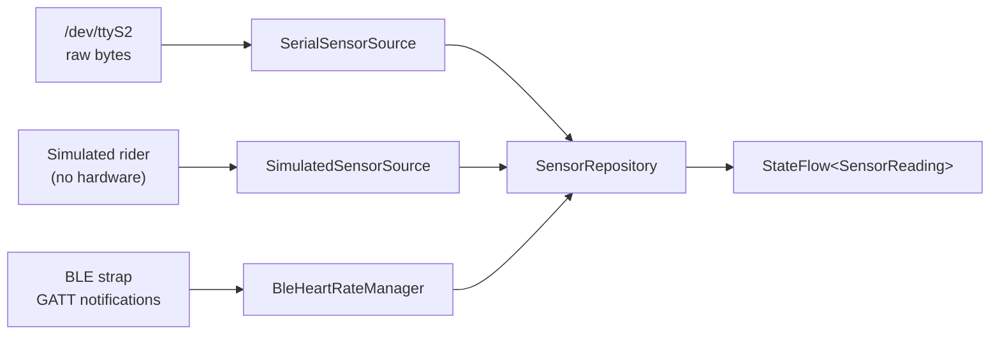
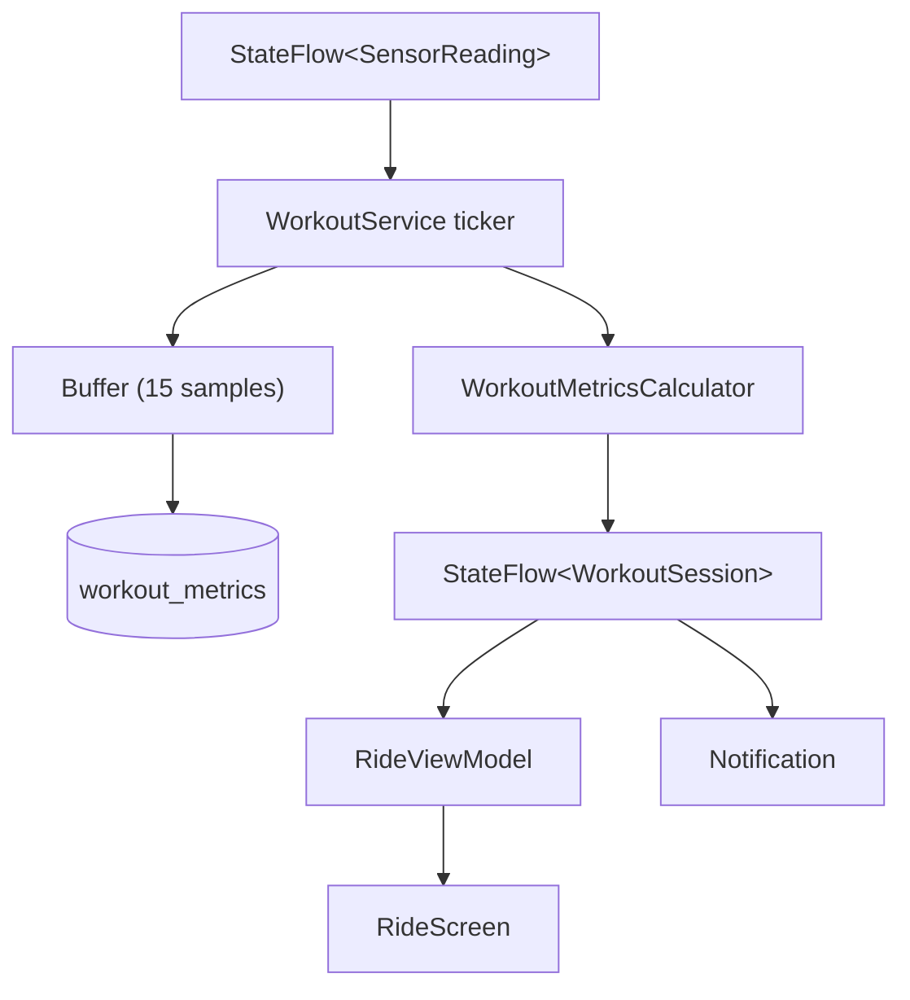
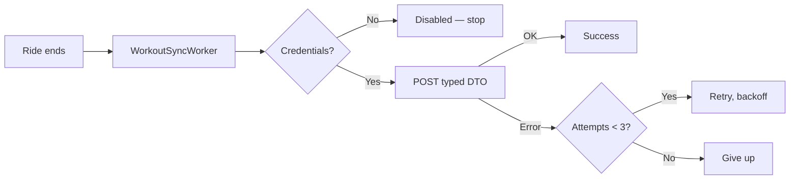

# Pelonot — Technical Overview

How data gets into the app, what happens to it, and where it goes.

**Target:** API 24 (Android 7.0) – API 34 · **Kotlin** · **Jetpack Compose**

---

## The one-paragraph version

Bytes arrive from the bike's sensor board over a serial character device. They
are decoded into cadence ticks and resistance readings, turned into a power
estimate, merged with heart rate from a Bluetooth strap, and published as a
single `StateFlow<SensorReading>`. A foreground service samples that flow once a
second, writes each sample to SQLite, and keeps running totals. When the ride
ends the totals are finalised on the workout row, analysed for an FTP
breakthrough, and optionally uploaded. Everything works with no network; the
cloud is a mirror, never a dependency.

---

## 1. Data coming in

There are three independent inputs. Nothing else enters the app.



### 1a. The bike — serial

The Gen 1/Gen 2 sensor board exposes a UART as a character device. It is read as
a plain file; baud rate and line discipline are whatever the kernel already has
configured at boot.

The wire protocol is single-byte commands:

```
'C'          one flywheel revolution
'R' <value>  resistance knob position (0–100)
```

Reads are **not framed**. A 64-byte read can end on an `R` whose value byte
arrives in the next read, so `SerialProtocolParser` is a stateful stream parser
that carries the partial command across the boundary. It also has to treat the
byte after `R` as a value even when it happens to equal `'C'` (67).

`SensorSource` exposes this as a **cold flow**: collecting opens the port,
cancelling closes it, and transport errors are *thrown* rather than swallowed so
the collector can decide what to do.

### 1b. Cadence and power — derived, not measured

The board reports ticks, not RPM, and does not report power at all.

- **`CadenceTracker`** converts tick timestamps to RPM, averaging a short window
  to damp jitter. Critically it is also polled on a timer, so cadence **decays
  to zero** when ticks stop — otherwise a rider who stops pedalling keeps
  reading 90 RPM forever and every downstream metric keeps accruing.
- **`PowerModel`** estimates watts as a cubic in cadence scaled by resistance.

> ⚠️ **The power coefficients are unvalidated.** Absolute watts should not be
> trusted against a real power meter, and FTP derived from them is
> self-consistent only — comparable between your own rides, not with anyone
> else's. Tracked as PLAN.md item 2.2.4.

### 1c. Heart rate — Bluetooth LE

Standard Heart Rate Service (`0x180D`), Heart Rate Measurement characteristic
(`0x2A37`). Scanning filters on the service UUID rather than device names.

Connecting is a four-step handshake, and the fourth step is the one that is
easy to miss:

1. Scan and connect GATT
2. Discover services
3. `setCharacteristicNotification(...)` — routes notifications *locally*
4. **Write `ENABLE_NOTIFICATION_VALUE` to the CCCD descriptor** — this is what
   actually tells the strap to start sending. Without it, nothing ever arrives.

Packets are `[flags][value…]`. Bit 0 of flags selects uint8 or little-endian
uint16. Parsing is bounds-checked and returns null on a truncated packet: it
runs on the Binder callback thread, where an exception kills the process.

`heartRateBpm` is nullable everywhere. **Null means unknown**, and must never be
conflated with a measured zero — a rider with no strap is not a rider with no
pulse.

### 1d. Simulation

`SimulatedSensorSource` generates a plausible effort profile — warmup ramp, two
sinusoids of different periods, per-sample jitter, and heart rate integrated
towards a power-derived target so it lags the way a real one does. Power runs
through the same `PowerModel`, so everything downstream sees numerically
consistent data rather than a parallel set of fake values.

Selected by `SensorMode` in Settings:

| Mode | Behaviour |
|------|-----------|
| `Auto` | Serial if the device exists, otherwise simulated |
| `Hardware` | Serial only — **retries rather than falling back** |
| `Simulated` | Always fake, for development |

`Hardware` never falls back on purpose: silently substituting invented telemetry
mid-ride would write fabricated numbers into the rider's permanent record.

### 1e. Merging and retries

`SensorRepository` merges the bike source with heart rate into one
`StateFlow<SensorReading>`, and owns **all** retry policy — one `retryWhen` with
capped exponential backoff. Sources deliberately do not reconnect themselves;
when they did, `close()` triggered a reconnect and `reconnect()` called
`close()`, so ending a workout started an endless loop.

---

## 2. Data flowing through a ride



`WorkoutService` is a bound foreground service. On ride start it:

1. Inserts the `workouts` row with `is_complete = 0`
2. Starts the sensor repository
3. Starts a 250 ms ticker

**The workout row must exist first.** `workout_metrics` has a foreign key onto
`workouts`, so writing a sample against a row that does not yet exist raises a
constraint violation — which is exactly what happened when the row was only
inserted at ride end, and why no ride ever captured a time series.

Each whole second the ticker:

- reads the latest `SensorReading`
- folds it into `WorkoutMetricsCalculator`
- appends a `WorkoutMetricEntity` to an in-memory buffer, flushed every 15
  samples (one transaction per second for an hour is a lot of writes on
  tablet-grade flash)
- updates the session's running means

**Elapsed time is measured, not counted** — `SystemClock.elapsedRealtime()`
minus accumulated pause time. A `delay(1000)` loop drifts, because `delay` is a
lower bound and the loop body's own cost accumulates.

### What the calculator derives

| Metric | How |
|--------|-----|
| Total output (kJ) | `∫P dt` by the trapezoidal rule against **elapsed time** |
| Distance (km) | Revolutions × 2.1 m, accumulated |
| Rolling averages | 1 s / 5 s / 30 s time windows |
| Power zone | `PowerZone.forPower(watts, ftp)` |

Sample gaps are clamped at 5 s, so a backgrounded app cannot integrate idle time
as though the rider pedalled through it.

---

## 3. Where data comes to rest

```
profiles ──┬─< workouts ──< workout_metrics
           │      │           (CASCADE delete)
class_templates ──┘
```

| Table | Written when | Contains |
|-------|-------------|----------|
| `profiles` | Profile created/edited | Name, weight, FTP |
| `class_templates` | First launch (seeded) | Title, category, duration, `intervals_json` |
| `workouts` | Ride **start**, updated at end | Aggregates, RPE, `is_complete` |
| `workout_metrics` | Every second | Cadence, resistance, power, HR |

`is_complete` does double duty: it keeps in-progress rides out of history and
leaderboards, and it is the crash-recovery marker — an unfinished row means the
process died mid-ride.

App preferences (theme, sensor mode, selected profile, strap address, sync
toggle) live in **DataStore**, not Room, since they are not relational.

> **Pre-release:** the database uses `fallbackToDestructiveMigration()`. Replace
> it with explicit migrations before the first real user installs a build.

### Class templates in

`assets/classes/<category>/<id>.json` — the seeder lists the directory, so
adding a folder is enough.

```json
{
  "id": "TB-01",
  "title": "Tabata Sprint 20",
  "category": "Tabata Bursts",
  "duration_sec": 1200,
  "intervals_json": "[{\"time_start_sec\":0,\"time_end_sec\":240,\"target_cadence_min\":80,\"target_cadence_max\":90,\"target_power_zone\":1}]"
}
```

`intervals_json` is a JSON **string** containing an array. Field names are
snake_case and segments carry start/end timestamps rather than durations —
`Interval` matches this exactly with `@SerialName`. When it did not, every
decode threw and no class ever displayed a single interval.

---

## 4. Data going out

### To the screen

Room and DataStore expose `Flow`s. Repositories combine them, ViewModels
`stateIn` them, and Compose collects with `collectAsStateWithLifecycle` so
collection stops when the app is backgrounded.

```
Room/DataStore Flow → Repository → ViewModel StateFlow → Composable
```

No composable touches a DAO. Nothing lives in `remember {}` that should survive
rotation.

### To the cloud (optional)



Credentials come from `local.properties` → `BuildConfig`, never from source:

```properties
supabase.url=https://your-project.supabase.co
supabase.anonKey=your-anon-key
```

Omit them and `SupabaseModule.client` is null, every call returns
`SyncOutcome.Disabled`, and the app is fully functional offline. `Disabled` is
deliberately distinct from `Failed` so the worker can tell "there is no cloud,
stop asking" from "the network is down, try again".

Payloads are typed `@Serializable` DTOs. They were previously
`Map<String, Any?>` — kotlinx.serialization has no serializer for `Any`, so
every call threw and was swallowed by `runCatching`.

### To the analyser

On ride end, `PostWorkoutAnalyzer` reads the full metric series and looks for:

- **20-minute peak power** → `FTP ≈ P₂₀ × 0.95`, via an O(n) sliding window over
  full-length windows only
- **Biometric decoupling** — sustained Zone 4 at under 80% of max HR
- **RPE** — a hard class rated ≤ 4 suggests a 3% bump

A proposal only surfaces if it beats the current FTP by more than 2%; below that
it is inside the noise of the power model.

---

## 5. What is not wired yet

Three flows exist as components but nothing connects them. See PLAN.md phase 9.

| Gap | State |
|-----|-------|
| **Class intervals do not drive a ride** | They parse and render, but no engine advances through them during a workout |
| **The HUD overlay never appears** | Built and permission-gated; nothing calls `show()` |
| **Cloud sync is never triggered** | `WorkoutSyncWorker` is correct; nothing calls `enqueue()` |

And nothing has been verified against a real bike — the serial path, the
protocol assumptions and the power curve are all unproven on hardware.

---

## Build

```bash
./gradlew assembleDebug            # Build
./gradlew testDebugUnitTest        # 83 JVM tests
./gradlew connectedDebugAndroidTest # DAO tests (needs a device)
./gradlew installDebug             # Install
```

Dependency versions are centralised in `gradle/libs.versions.toml`.

### Permissions

| Permission | For |
|-----------|-----|
| `SYSTEM_ALERT_WINDOW` | Floating HUD over other apps |
| `FOREGROUND_SERVICE`, `..._DATA_SYNC` | Workout service |
| `POST_NOTIFICATIONS` | Ride notification (API 33+) |
| `BLUETOOTH_SCAN`, `BLUETOOTH_CONNECT` | Heart rate strap (API 31+) |
| `BLUETOOTH`, `BLUETOOTH_ADMIN`, `ACCESS_FINE_LOCATION` | Heart rate strap (API 24–30) |
| `INTERNET`, `ACCESS_NETWORK_STATE` | Optional cloud sync |
